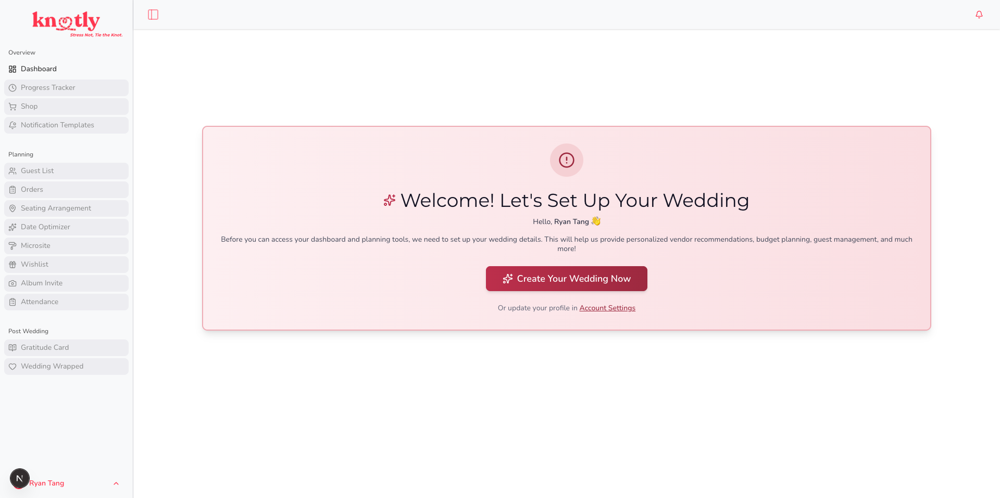
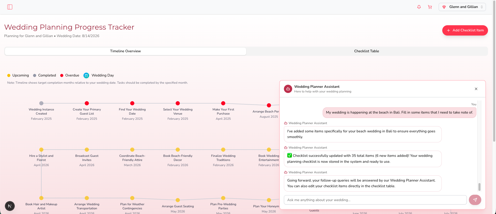
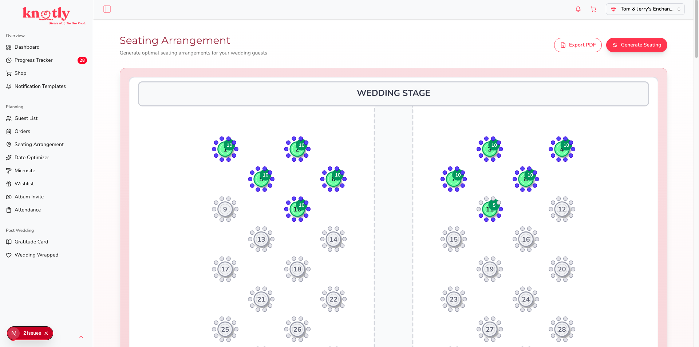
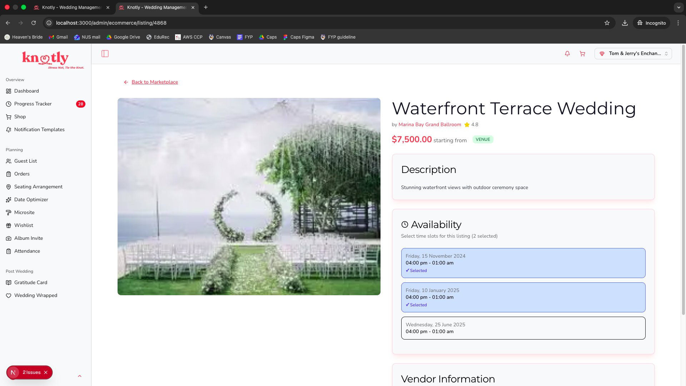
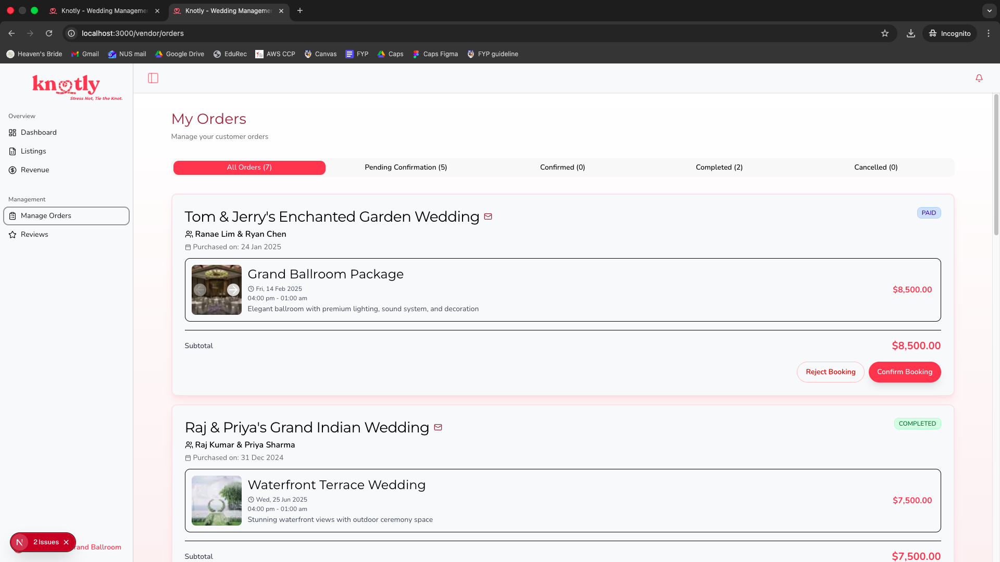
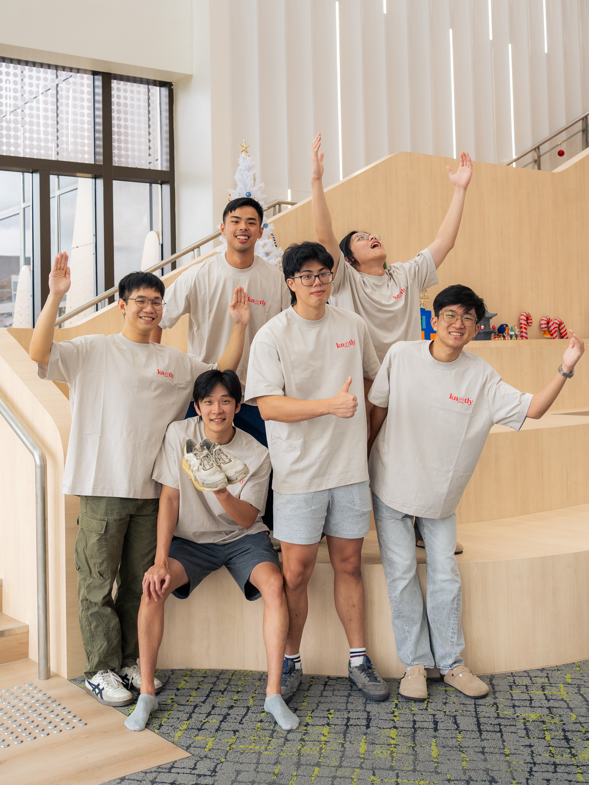

<h1 align="center">Knotly</h1>

<p align="center">
  
</p>

<p align="center">
  <b>An AI-powered, end-to-end wedding planning platform that supports couples through every phase of their journey — before, during, and after the big day.</b>
</p>

Knotly reimagines wedding planning as a true end-to-end experience for couples, guests, and vendors alike, covering the entire lifecycle of a wedding:

- **Before the big day** — AI-generated planning checklists, vendor discovery and bookings, budget tracking, seating optimization, and date scheduling.
- **On the big day** — guest-facing microsites, RSVP invitations, self-attendance check-in, and live guestbook.
- **After the big day** — gratitude card generation, face-clustered photo albums, cash gift settlement, and vendor reviews.

**Previously deployed to production** at `knotly.app` (couples & guests) and `core.knotly.app` (vendor & admin portal) on AWS via SST and OpenNext. The live site has been retired post-graduation; see the screenshots below for a walkthrough.

---

## Highlights

- **Three-tier architecture** across a Next.js 15 / React 19 frontend, a NestJS + Prisma + PostgreSQL core backend (27+ feature modules), and a Python FastAPI AI service.
- **Production deployment on AWS** via SST and OpenNext — CloudFront, Lambda, S3, DynamoDB, SQS, Route53, with Infrastructure as Code (AWS CDK) and GitHub Actions CI/CD.
- **Real AI / ML features**, not gimmicks:
  - Constraint-satisfaction **seating optimization** (linear programming with PuLP, relationship graphs via NetworkX).
  - **Wedding date scheduling** using weighted availability matrices across the couple and key attendees.
  - **Hybrid vendor recommender** combining K-Means clustering, neighbor-weighted collaborative filtering (KNN), and content-based similarity.
  - **Photo album face clustering** using HOG face detection, 128-d face encodings, blur detection, CLAHE preprocessing for low-light shots, and DBSCAN-based clustering with multi-stage merging.
  - OpenAI-powered planning **chatbot** that walks couples through their checklist stage-by-stage.
- **Marketplace features**: vendor listings, cart and orders, Stripe payments and webhooks, refunds, reviews and ratings, vendor onboarding flow with super-admin approval.
- **Guest experience**: per-wedding **microsites**, RSVP invitations, self-attendance check-in, cash gifts and wishlists, guestbook, and gratitude card generation.
- **Couple toolkit**: AI-generated planning checklist, Google Calendar integration with collaborator access requests, budget tracking, seating chart editor, and PDF/email exports.

---

## Repository layout

This repository is a meta-repo that pulls together three independent codebases as git submodules. Each submodule has its own detailed README covering architecture, setup, and engineering decisions.

| Submodule | Stack | Role |
| --- | --- | --- |
| [frontend/](frontend/) | Next.js 15, React 19, TypeScript, Tailwind, Turborepo, SST | Customer-facing site (`knotly.app`) and admin/vendor portal (`core.knotly.app`) |
| [core-backend/](core-backend/) | NestJS 10, TypeScript, Prisma, PostgreSQL, Stripe, SendGrid, AWS Lambda | Domain backend — auth, payments, weddings, vendors, microsites, calendar, email, etc. |
| [ai-backend/](ai-backend/) | FastAPI, Python, scikit-learn, PuLP, NetworkX, face-recognition, OpenCV, dlib | AI / ML microservice — seating, scheduling, recommendations, photo processing |

For per-service deep dives, see [frontend/README.md](frontend/README.md), [core-backend/README.md](core-backend/README.md), and [ai-backend/README.md](ai-backend/README.md).

---

## Architecture at a glance

```
                       ┌─────────────────────────────────────┐
                       │           Users & Guests            │
                       └──────────────────┬──────────────────┘
                                          │
                  ┌───────────────────────┴───────────────────────┐
                  ▼                                               ▼
        ┌──────────────────┐                            ┌──────────────────┐
        │  knotly.app      │                            │ core.knotly.app  │
        │  (external app)  │                            │ (internal app)   │
        │  Next.js 15      │                            │  Next.js 15      │
        └────────┬─────────┘                            └────────┬─────────┘
                 │                                               │
                 └──────────────────────┬────────────────────────┘
                                        ▼
                          ┌──────────────────────────┐
                          │     Core Backend         │
                          │     NestJS + Prisma      │
                          │     PostgreSQL           │
                          └────────────┬─────────────┘
                                       │
                       ┌───────────────┼───────────────┐
                       ▼               ▼               ▼
                ┌───────────┐   ┌────────────┐   ┌────────────┐
                │ AI Service│   │  Stripe    │   │ SendGrid / │
                │  FastAPI  │   │  Payments  │   │  Google    │
                │  ML / CV  │   │            │   │  Calendar  │
                └───────────┘   └────────────┘   └────────────┘
```

The frontend is split into two Next.js apps inside one Turborepo workspace and deployed independently to CloudFront via OpenNext. The core backend is deployed as a Lambda (with a serverless-express adapter), backed by an RDS PostgreSQL database managed via Prisma. The AI backend is a separate FastAPI service (Mangum adapter for Lambda) so heavy ML dependencies stay isolated from the main API.

---

## Screenshots

<p align="center">
  
  <br />
  <em>Logged-in landing: the couple's home base, surfacing planning progress at a glance.</em>
</p>

<p align="center">
  
  <br />
  <em>Wedding progress planner: AI-generated, stage-by-stage planning checklist tailored to the couple.</em>
</p>

<p align="center">
  
  <br />
  <em>Seating chart editor: drag-and-drop layout backed by a constraint-satisfaction optimizer (PuLP + NetworkX).</em>
</p>

<p align="center">
  
  <br />
  <em>Vendor marketplace: discover, filter, and shortlist vendors, ranked by the hybrid recommender.</em>
</p>

<p align="center">
  
  <br />
  <em>Orders &amp; bookings: Stripe-powered checkout, refunds, and vendor booking confirmations.</em>
</p>

---

## Tech stack

**Frontend** — Next.js 15, React 19, TypeScript, Tailwind CSS, shadcn/ui, Turborepo, Zustand, NextAuth, Framer Motion, React Three Fiber, AI SDK, Recharts.

**Core backend** — NestJS 10, TypeScript, Prisma 6, PostgreSQL, Stripe, SendGrid, Google APIs (Calendar), OpenAI SDK, PDFKit, Handlebars, JWT auth, class-validator.

**AI backend** — FastAPI, scikit-learn, PuLP (LP solver), NetworkX, pandas/numpy, face-recognition, OpenCV, dlib, Loguru.

**Infrastructure** — AWS (Lambda, CloudFront, S3, DynamoDB, SQS, Route53, RDS), SST, OpenNext, AWS CDK, GitHub Actions, Docker.

---

## Running locally

The full stack runs locally in three terminals. Each submodule has its own setup instructions; the steps below are the quick path.

**1. Clone with submodules**

```bash
git clone --recurse-submodules https://github.com/tristantanjh/knotly-core.git
cd knotly-core
```

If you already cloned without `--recurse-submodules`:

```bash
git submodule update --init --recursive
```

**2. Core backend** (port 8080, requires Docker for Postgres)

```bash
cd core-backend
npm install
npm run docker:dev:up           # or docker:dev:up:windows on Windows
npm run prisma:schema:update    # apply schema
npm run prisma:seed:dev         # seed sample data
npm run dev
```

You will need a `.env` file with the database URL, Stripe keys, SendGrid keys, Google OAuth credentials, and OpenAI key. See [core-backend/README.md](core-backend/README.md) for the full list.

**3. AI backend** (port 8001)

```bash
cd ai-backend
docker compose up --build
```

Or without Docker, follow the manual setup in [ai-backend/README.md](ai-backend/README.md).

**4. Frontend** (external on 3000, internal on 3001)

```bash
cd frontend
npm install
npm run dev
```

Open [http://localhost:3000](http://localhost:3000) for the customer site and [http://localhost:3001](http://localhost:3001) for the admin portal.

---

## The team

<p align="center">
  
</p>

<p align="center">
  Knotly was built by our team of six as our final-year capstone project.
</p>

---

## License

[MIT](LICENSE)
